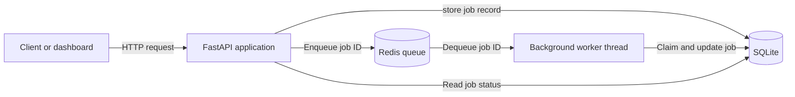

# Background Job Queue and Monitoring System

A RESTful background job-processing service built with FastAPI, Redis,
and SQLite. The application accepts jobs through an HTTP API, places
their IDs in a Redis queue, and processes them asynchronously with a
background worker thread.

The project demonstrates API design, persistent job state, queue-based
background processing, retry handling, automated testing, and
containerized local development.

## Features

- Submit background jobs through a REST API
- Track job statuses and results
- Filter and paginate job records
- Process queued jobs with a Redis-backed worker
- Automatically retry failed jobs
- Manually requeue completed or failed jobs
- Prevent duplicate job claims with conditional state transitions
- View queue statistics and recovery actions through a monitoring dashboard
- Persist job records in SQLite
- Run the API and Redis services with Docker Compose
- Test API and database behavior with Pytest

## Architecture
The FastAPI application exposes the REST API and monitoring dashboard.
When a client submit a job, the API stores the job record in SQLite and pushes only its ID to Redis. 
A background worker thread blocks on the Redis queue, claims the corresponding SQLite record, executes the job, and updates its status and result.





SQLite is the source of truth for job state and result. Redis is used for queue delivery, while the conditional SQLite update ensures that only a job whose current status is 'queued' can be claimed for processing. 


## Job Lifecycle

1. A client submits a job with 'POST /api/jobs'.
2. The API creates a SQLite record with the 'queued' status
3. The API pushes the new job ID to Redis.
4. The worker removes the ID from Redis and conditionally changes the job status from 'queued' to 'processing'.
5. If execution succeeds, the worker stores the result and changes the status to 'done'.
6. If execution fails and retires remain, the worker returns the job to the 'queued' state and pushes its ID back to Redis.
7. When no retries remain, the worker changes the status to 'failed'.
8. A completed or failed job can be manually requeued through the API or the monitoring dashboard.


## Quick Start

### Option 1: Run with Docker Compose

Requirements:

- Docker Desktop
- Docker Compose

Build and start the FastAPI and Redis services:

```powershell
docker-compose up --build
```

After the services start, open:

- API documentation: <http://localhost:8000/docs>
- Monitoring dashboard: <http://localhost:8000/dashboard>
- Health check: <http://localhost:8000/health>

Stop the services with:

```powershell
docker-compose down
```

The SQLite database is stored in the `sqlite_data` Docker volume, so job data
persists when the containers are stopped and restarted.


### Option 2: Run Locally for Development

Requirements:

- Python 3.12 or later
- Docker Desktop or another running Redis server

Create and activate a virtual environment in Windows PowerShell:

```powershell
python -m venv .venv
.\.venv\Scripts\Activate.ps1
```

Install the Python dependencies:

```powershell
python -m pip install -r requirements.txt
```

Start Redis with Docker Compose:

```powershell
docker-compose up -d redis
```

Start the FastAPI development server:

```powershell
uvicorn api.main:app --reload
```

## API Reference

The complete interactive API documentation is available at
<http://localhost:8000/docs> while the application is running.

### Main Endpoints

| Method | Endpoint | Description |
| --- | --- | --- |
| `POST` | `/api/jobs` | Create and enqueue a job |
| `GET` | `/api/jobs` | List jobs with optional filtering and pagination |
| `GET` | `/api/jobs/stats` | Return queue statistics grouped by status |
| `GET` | `/api/jobs/count` | Count all jobs or jobs with a selected status |
| `GET` | `/api/jobs/{job_id}` | Return one job |
| `POST` | `/api/jobs/{job_id}/requeue` | Reset and requeue a non-processing job |
| `DELETE` | `/api/jobs/{job_id}` | Delete a non-processing job |

### Create a Job

```bash
curl -X POST http://localhost:8000/api/jobs \
  -H "Content-Type: application/json" \
  -d '{"payload":"send welcome email","max_retries":3}'
```

Example response:

```json
{
  "id": "3ec3a62f-37c9-4fc1-9130-e2fb28f9727c",
  "payload": "send welcome email",
  "status": "queued",
  "created_at": "2026-09-11T18:30:00+00:00",
  "updated_at": "2026-09-11T18:30:00+00:00",
  "result": null,
  "error": null,
  "attempts": 0,
  "max_retries": 3
}
```

### Filter and Paginate Jobs

The following request returns up to 20 failed jobs after skipping the first
10 matching records:

```bash
curl "http://localhost:8000/api/jobs?status=failed&limit=20&offset=10"
```

Valid status filters are `queued`, `processing`, `done`, and `failed`.

### Requeue a Job

```bash
curl -X POST http://localhost:8000/api/jobs/JOB_ID/requeue
```

Requeuing clears the previous result and error, changes the status to `queued`,
and sends the job ID back to Redis for another processing attempt. A job in the
`processing` state cannot be manually requeued.

### Development Endpoints

The project also includes `PATCH /api/jobs/{job_id}/status` and
`POST /api/jobs/{job_id}/run` for local demonstration and debugging. These
endpoints are not intended as production job-management operations.


