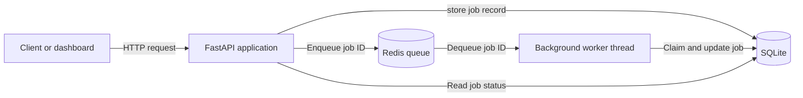

# Background Job Queue and Monitoring System

A RESTful background job-processing service built with FastAPI, Redis,
and SQLite. The application accepts jobs through an HTTP API, places
their IDs in a Redis queue, and processes them asynchronously with a
background worker thread.

The project demonstrates API design, persistent job state, queue-based
background processing, retry handling, automated testing, and
containerized local development.

## Features

- Submit background jobs through a REST API
- Track job statuses and results
- Filter and paginate job records
- Process queued jobs with a Redis-backed worker
- Automatically retry failed jobs
- Manually requeue completed or failed jobs
- Prevent duplicate job claims with conditional state transitions
- View queue statistics and recovery actions through a monitoring dashboard
- Persist job records in SQLite
- Run the API and Redis services with Docker Compose
- Test API and database behavior with Pytest

## Architecture
The FastAPI application exposes the REST API and monitoring dashboard.
When a client submit a job, the API stores the job record in SQLite and pushes only its ID to Redis. 
A background worker thread blocks on the Redis queue, claims the corresponding SQLite record, executes the job, and updates its status and result.

SQLite is the source of truth for job state and result. Redis is used for queue delivery, while the conditional SQLite update ensures that only a job whose current status is 'queued' can be claimed for processing. 

## Job Lifecycle

1. A client submits a job with 'POST /api/jobs'.
2. The API creates a SQLite record with the 'queued' status
3. The API pushes the new job ID to Redis.
4. The worker removes the ID from Redis and conditionally changes the job status from 'queued' to 'processing'.
5. If execution succeeds, the worker stores the result and changes the status to 'done'.
6. If execution fails and retires remain, the worker returns the job to the 'queued' state and pushes its ID back to Redis.
7. When no retries remain, the worker changes the status to 'failed'.
8. A completed or failed job can be manually requeued through the API or the monitoring dashboard.

## 技术栈

- Python 3.12
- FastAPI
- Uvicorn
- Pydantic
- 标准库：`threading`, `time`, `uuid`, `datetime`

---
